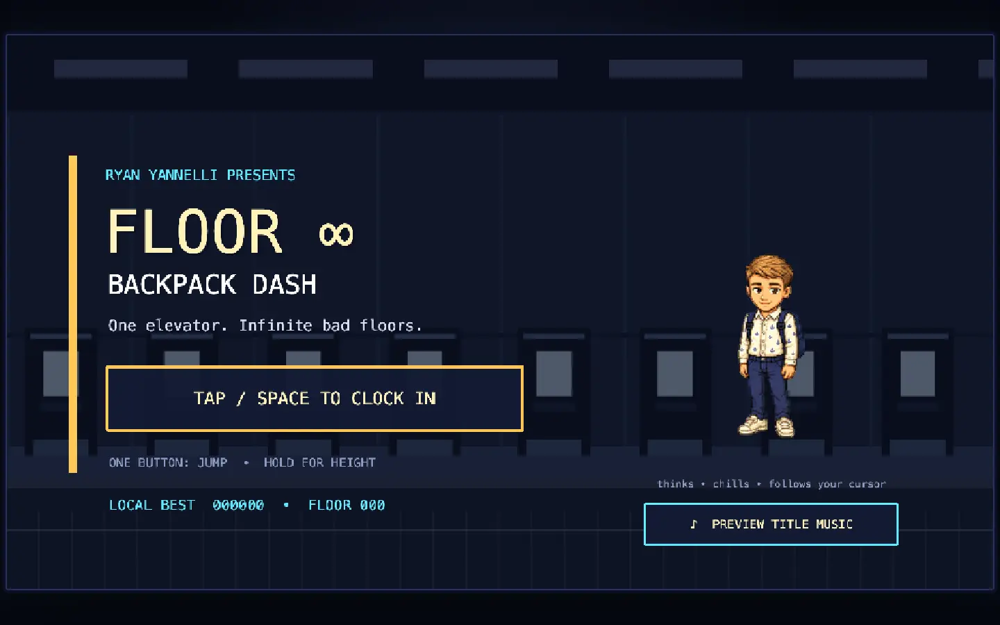
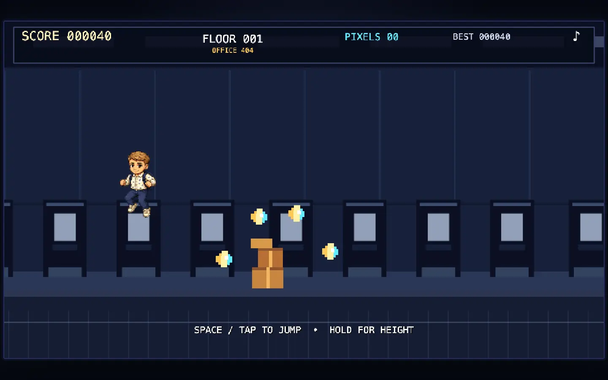
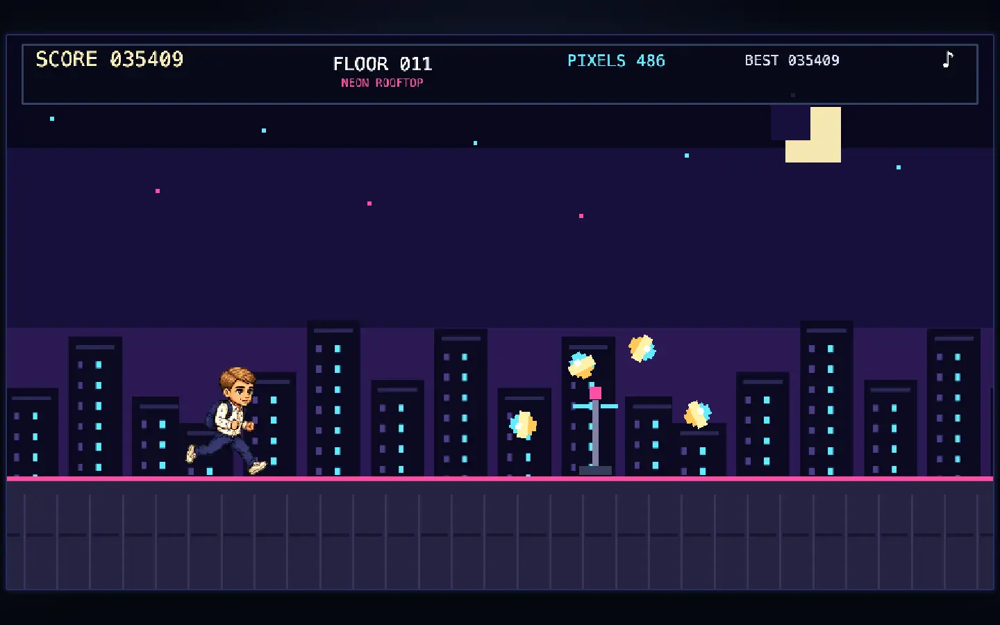

# Floor ∞: Backpack Dash

Backpack Dash is an offline-first endless pixel runner starring Mini Ryan. Run through Office 404, Neon Rooftop, Midnight Subway, and Server Basement. Collect lost pixels and survive as long as possible.

Each floor targets about 28 seconds of running. Floor distance increases from 8,400 pixels at the starting speed to 15,960 pixels at the speed cap. This keeps later floors from getting shorter as Ryan accelerates.

The game generates its soundtrack and sound effects live with Web Audio. Each theme has its own lead pattern, timbre, bass, drums, and higher-floor intensity layers. The game synthesizes cues for starts, jumps, landings, pickups, clean floors, pause/resume, failure, and new bests.

Each level-up plays a three-part elevator sequence: mechanical entry and door close, a rising travel chime, then a brighter exit and door-open cue. The destination floor and theme control the pitch and timbre variations.

On the title screen, Mini Ryan cycles through `ryan-review`, `ryan-waiting`, `ryan-working`, and `ryan-idle`. The title sprite runs at one-fifth of the regular animation clock and displays 1.2 to 1.4 frames per second. Pointer gaze briefly interrupts the loop, then returns control to it. Browsers block audible autoplay before a gesture. `PREVIEW TITLE MUSIC` starts the title soundtrack without starting the run.

## Screenshots

<table>
  <tr>
    <td width="50%">
      
      <br>
      <sub>Title screen</sub>
    </td>
    <td width="50%">
      
      <br>
      <sub>Office 404</sub>
    </td>
  </tr>
  <tr>
    <td colspan="2">
      
      <br>
      <sub>Neon Rooftop, Floor 11</sub>
    </td>
  </tr>
</table>

## Play locally

**Requirements:** pnpm and Node.js 20.19+, 22.12+, or 24+.

```bash
pnpm install
pnpm dev
```

Open the local URL that Vite prints. The game uses a fixed `960×540` logical canvas and scales it to the browser window.

Controls:

- `Space`, `Arrow Up`, click, or tap: jump. Hold briefly for a higher jump.
- `P` or `Escape`: pause or resume.
- `M`: mute or unmute.

## Production build

```bash
pnpm build
pnpm preview
```

Vite writes the static production bundle to `dist/`. The game has no backend, analytics, account, or runtime network dependency.

The browser stores the mute preference, best score, best distance, best floor, and the last 5 runs under `mini-ryan-backpack-dash:v1`. Each saved run includes the score, distance, floor, lost pixels, clean floors, seed, and an ISO completion timestamp.

Add a seed to the URL to reproduce a run:

```text
http://127.0.0.1:5173/?seed=floor-404
```

## Verification

```bash
pnpm test
pnpm build
pnpm test:e2e
pnpm test:soak
```

The tests cover:

- Scoring and save recovery.
- Seeded generation, jump timing, and animation mappings.
- 3,000 generated-floor simulations.
- Responsive browser controls, pause/mute behavior, and game-over retry.
- Package privacy.
- A five-minute object-pool/frame-rate soak.

## Asset provenance

`public/assets/mini-ryan.webp` is a byte-for-byte copy of the installed Mini Ryan v2 pet atlas. The project excludes the source portrait and pet-generation working files.

The game renders the physics player and visible character separately. The hitbox stays fixed at `74×160`. The visible sprite uses per-frame corrections on the five jump frames:

- Scale: 0.713 to 0.767 against the 0.56 base.
- Y offset: -21 to +21 pixels.
- Angle: within 1 degree.

The original atlas stays unchanged, and the collision shape stays consistent.
